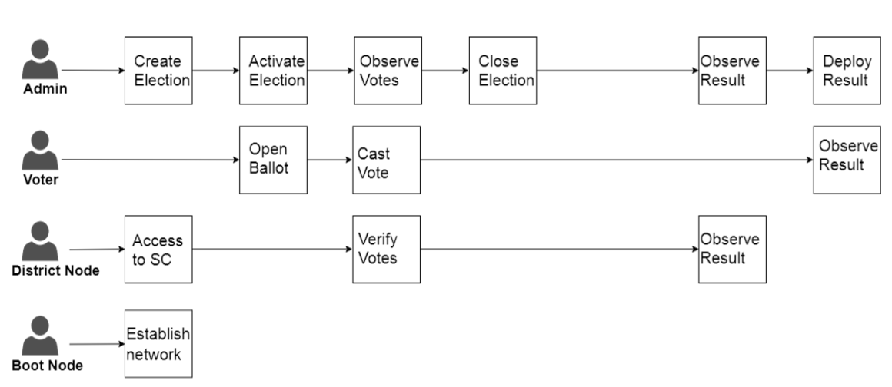
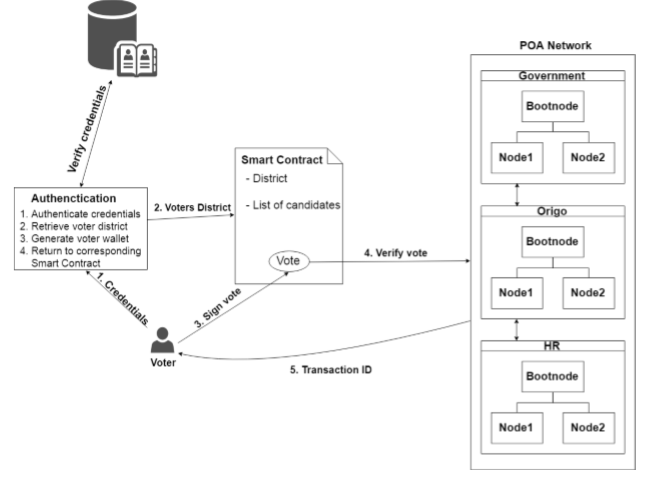

# E-voting
Blockchain based e-voting system

Using Azure Blockchain to build a reliable e-voting paltform which aims at improving the security and decreases the cost of hosting a nationwide election.
The distributed, immutable, incontrovertible, public ledger characterstics of the blockchain technology can be exhausted to come up with a system that is immune to the hacking accutions,alike the currently existing voting methodologies.

We plan to use a permissioned blockchain,(a variation of the consortium-based blockchain) which uses the proof-of-authority(POA) consensus algorithm. In Proof-Of-Authority based networks, transactions and blocks are validated by special approved accounts,the Validators.
A blockchain based system based on POA consensus algorithm will enable us to empower only certain numbers of users to be validators.
Validators can be paid for the services rendered.Moreover the main benifit of using a private blockchain is that, the danger of eavesdropper or unauthorised personnel gaining access to the incoming data.

Smart contract comprises of the roles in our model,major roles to be verified using a smart contract (SC) in our model of e-voting system are

#Election Adminstrators - reponsible for all the major decisons regarding the election.
Actions:
1.Manage elections
2.Configurate ballots
3.Register voters
4.Decide the lifetime of the election      

#Voters - people who have the right to vote
Actions:
1.Authenticate themselves
2.Cast vote
3.Verify if their vote was counted, and counted correctly

#Constinuency node - representing each voting constituency
Actions:
1.When an election is created,each ballot smart contracts,representing each voting constituency, are deployed onto the blockchain.
2.Each of the corresponding constituency nodes are given permission to interact with their corresponding ballot smart contract.
3.To verify that a casted vote is valid.

#Boot node - the connecting node
Actions:
1.It acts as a medium of communication between all the constituenct nodes.

The election process,further more a smart contract is defined for each of the voting districts of the election.So multiple smart contracts are involved in an election. For each voter with its corresponding voting district location, defined in the voters registration phase, the smart contract with the corresponding location will be prompted to the voter after the user authenticates himself when voting. 

Mentioned below are the processes involved in ideal case of our model
* All the eligible voters have to register themselves for the election.
* The admin creates an election DAPP, which interacts with the smart contract which contains the information of all the participating.
* This smart contract creates a set of ballot smart contract for each constituency.
* Each vote i.e. a transaction is as per the ballot SC of that constituency, and the voter be provided with the UID for his transaction.
* Tally of results is maintained by each of the ballot smart contract.
* Each vote can be verified using the UID.

Each registered user has an ID and chooses a PIN, for unique identification of the personnel.
Workflow of our model
* For a user to succesfully authenticate a valid ID and a PIN number needs to be presented at the voting contituency.
* If authentication is succesful corresponding SC is prompted.
* After the voter has chosen a candidate,he signs the vote using his PIN.
* Then the voter data is verified by the corresponding constituency node, which voter is interacting with the SC.
* For the consensus of the transaction(vote), it ought to be agreed upon by majority corresponding constituency nodes.
* If accepted,then the user recieves a  transaction ID in form of a QR code(subjected to change). *which could be used to locate hos vote in the blockchain, verifying that it was counted and counted correctly.
* When casted vote is verfied a function in the SC adds one vote to the party which was voted for.
* Every transaction in form of vote is added to the blockchain once block time is reached.

